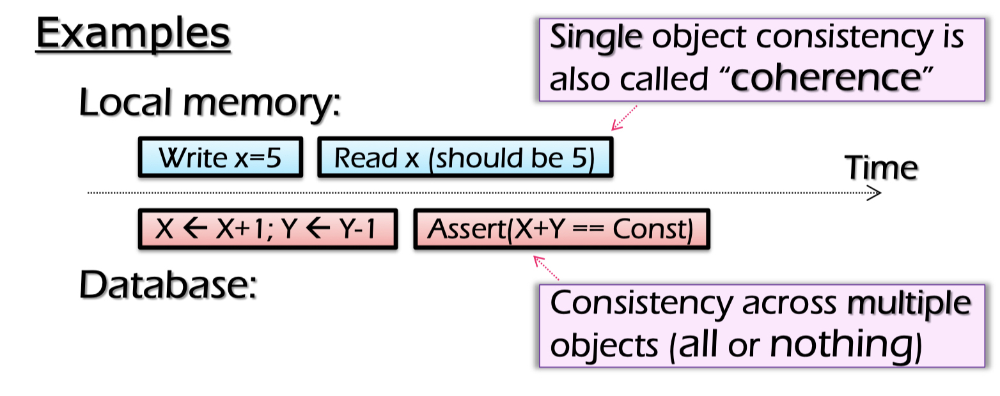

# Distributed System Consistency

## What is Consistency
> **Consistency model** defines rules for the apparent order and visibility of updates.
1. local memory:
Single object consistency is also called "coherence".
2. database:
Consistency across multiple objects (all or nothing).

 

## Difference between Consistency and Coherence.
  **Coherence** occurs in systems that are cached or cache-less, and it deals with maintaining a global order
in which writes to a single location or single variable are seen by all processors.
  **Consistency** deals with the ordering of operations to multiple locations with respect to all processors.
 

## Consistency Models
  **Consistency Models** are used in distributed systems like **Distributed Shared Memory** 
systems or distributed data store(such as **File Systems**, **Database**).
  **Consistency Models** specify some rules, if those rules are followed, memory will be consist, and the
results of *reading*, *writing*, or *updating* memory will be predictable.
  There are several DS consistency models, including **Strict Consistency**, **Sequential Consistency**,
**Causual Consistency**, **Release Consistency**, and **Eventual Consistency**.
 

## Consistency is hard in DS
Consistency is hard in distributed systems.
- Data replication.
- Concurrency.(no shared locks)
- Failure.(machines or network)
 

## Strict Consistency
 

## Sequential Consistency
 

## Release Consistency
 

## Causual Consistency
 

## Eventual Consistency
 

## Mutual Exclusion

CPU 0: W(X) R(Y)
CPU 1: w(Y) r(X)

All possible inter-leavings:

- W(X)1  R(Y)0  w(Y)1  r(X)1   (CPU 0 enters critical section)
- W(X)1  w(Y)1  R(Y)1  r(X)1   (none enters)
- W(X)1  w(Y)1  r(X)1  R(Y)1   (none enters)
- w(Y)1  W(X)1  R(Y)1  r(X)1   (none enters)
- w(Y)1  W(X)1  r(X)1  R(Y)1   (none enters)
- w(Y)1  r(X)0  W(X)1  R(Y)1   (CPU 1 enters critical section)
