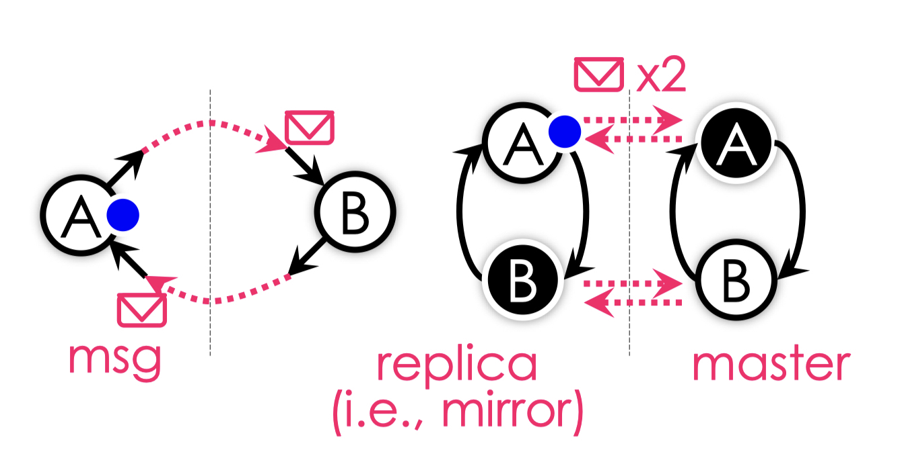
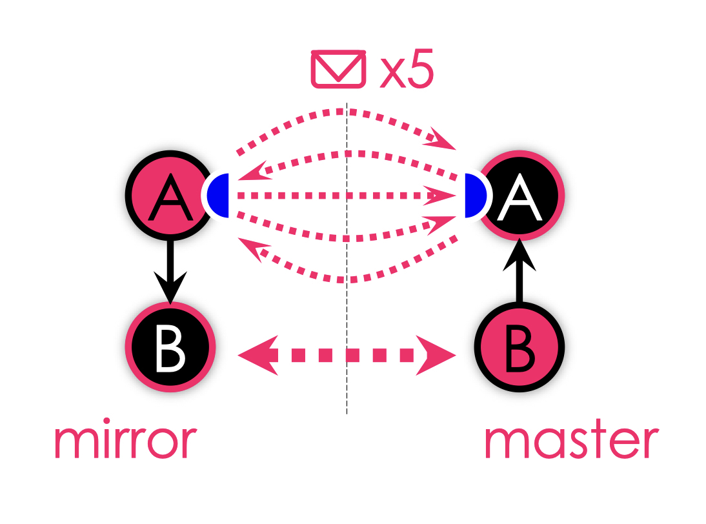
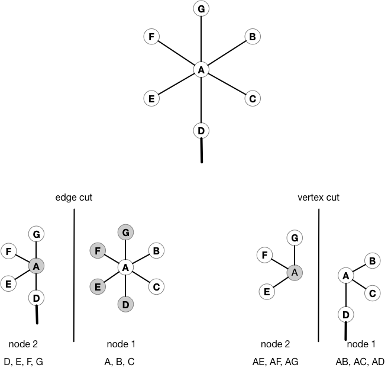
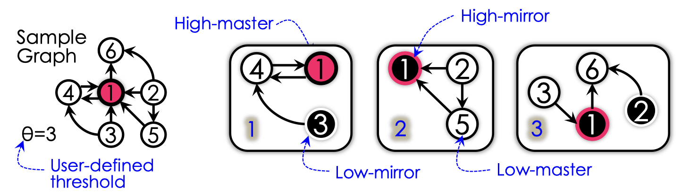
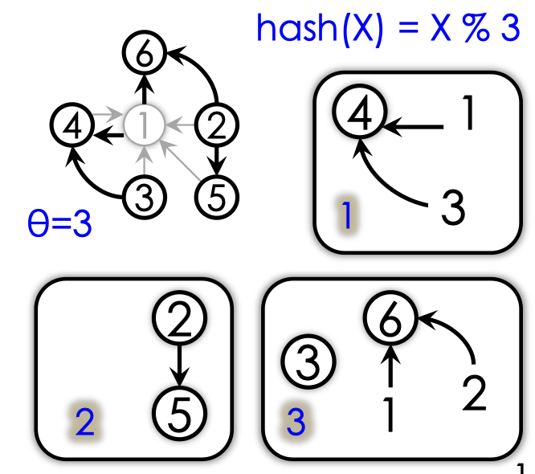
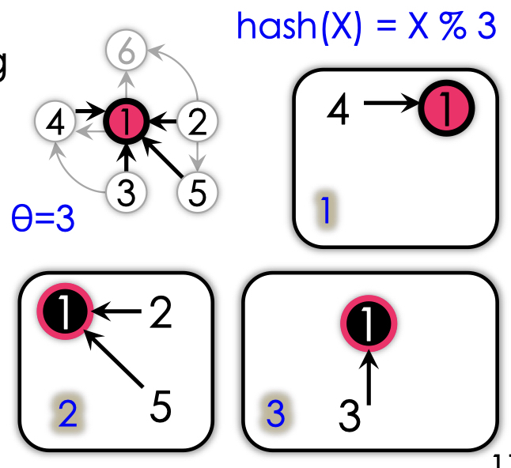
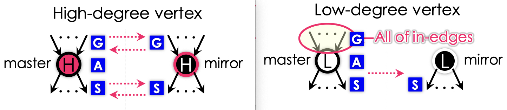

# PowerLyra

## 1. Graph are Everywhere
- Traffic network graphs
- Biological network
- Social network

## 2. Think like a vertex
  Coding graph algorithms as **vertex-centric** programs to process *vertices* in parallel and
communicate along *edges*.
 

## 3. Power-law degree distribution
> "*most* vertices have relative *few* neighbors while a *few* have *many* neighbors."

### 3.1 Challenge: Locality vs. Parallelism
  **Low-degree vertex** prefer *locality* over parallelism, since making resource locally
accessible can **reduce network latency**. As for parallelism, it is not worthwhile since it
will introduce more communication, computation and *synchronization* overhead. 
  **High-degree vertex** prefer *parallelism* over locality, since parallelism can evenly
**parallelize the workloads to avoid load imbalance**. As for locality, it is not worthwhile
since it will incur imbalance, high contention and *heavy network traffic*.
 

### 3.2 Dilemma in natural graph
  However, in natural graph, both Low-degree vertex and High-degree vertex can not be
ignored, for example, in Sina Blog, there are *100M* users who has *100* followers, and there
are *100* users who has *100M* followers. Therefore both Low-degree vertex and High-degree
vertex are important. 
  This necessitate a partition algorithm to take care of both **locality for low-degree vertex**
and **parallelism for high-degree vertex**.
 
 

## 4. Existing efforts

### 4.1 Pregel & GraphLab
  Focus on exploiting *Locality*  
  *Partition*: use *edge-cut* to evenly assign *vertices* along with all edges  
  *Computation*: *aggregate* all resources (i.e. messages or replicas) of a vertex on local 
machine  

### 4.2 PowerGraph & GraphX
  Focus on exploiting *Parallelism*  
  *Partition*: use *vertex-cut* to evenly assign *edges* with replicated vertices  
  *Computation*: *decompose* the workload of a vertex into multiple machines  

## 5. PowerLyra
  **PowerLyra** adopts differentiated graph computation & partition strategies on skewed graphs.
And it embraces both **locality** for *low-degree vertex* and **parallelism** for *high-degree 
vertex*.
 

### 5.1 Graph Partitioning
  *Both* vertex cut & edge cut will use *replicas*.
 

#### 5.1.1 Vertex cut
  **Vertex cut** will evenly assign **edges** with replicated vertices.
  *Replicas* store **incomplete** edges info.
  Computation will be parallelize on all replicas.

#### 5.1.2 Edge cut
  **Edge cut** will evenly assign **vertices** along with all edges.
  Masters store **complete** edges info.
  No computation task run on replicas.
 
  
#### 5.1.3 Hybrid-cut
  **Hybrid-cut**: differentiate graph partitioning for *low-degree* & *high-degree* vertices.
- **Low-cut**(inspired by edge-cut): reduce mirrors and exploiting locality for *low-degree
vertex*.
- **High-cut**(like vertex-cut): provide balance and restrict the impact of *high-degree
vertex*.

  **Low-cut** evenly assign *low-degree vertices* along with only *in-edges* to machines by
hashing **target** vertex.
- No duplicate edges
- Load balance(Vertices & Edges), since each low-degree vertex have smaller number
of edges, evenly distribute vertices will result in balanced edges.

  **High-cut** distribute one-direction *in-edges* of *high-degree vertex* to machines by hashing
**source** vertex.
- No duplicate edges
- Load balance(Edges & Vertices), since there are only a little high-degree vertices, add
replicas of high-degree vertices will not impact the balance of vertices.

### 5.2 Graph Computation

#### 5.2.1 Hybrid-model
  **Hybrid-model**: differentiate the graph computation model to high-degree & low-degree
vertices.
- **High-degree model** decomposes workload of high-degree vertices for load balance.
- **Low-degree model** minimize the communication cost for low-degree vertices.

