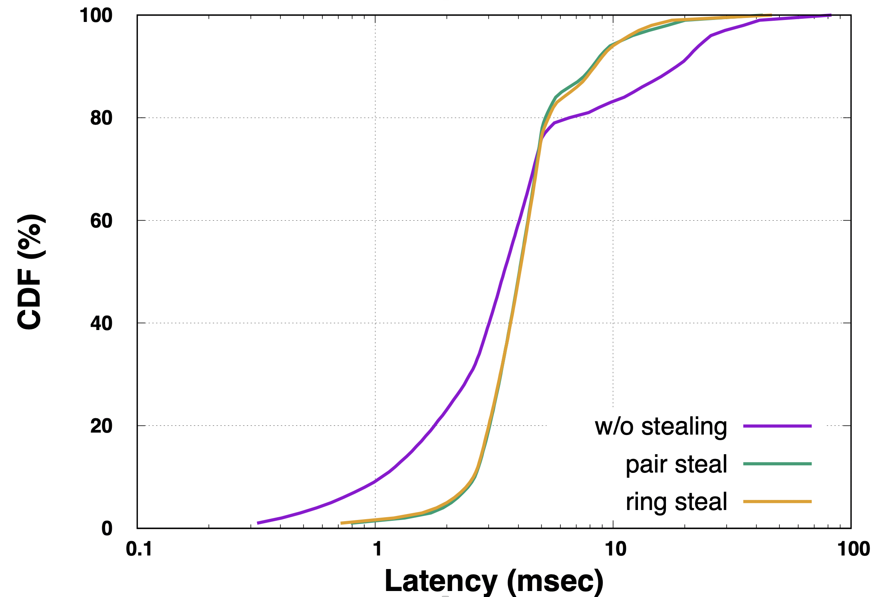

# Tail Latency

## 1. Backgrounds

### 1.1 Throughput & Latency
  **Throughput** measures the rate at which requests are processed. (ex: 1 M req/sec)  
  **Latency** measures how long a request will be processed. (ex: 18 ms)  
  **CDF** Figure is usually used to measure the latency distribution of requests. CDF stands for 
Cumulative Distribution Function. The x-axis of CDF Figure is latency, and the y-axis is the
percentage of requests whose latency is less than the corresponding x value.   
  For example, the point *(80%, 5ms)* means 80% percent of requests is processed in less than 5ms.
 

 

### 1.2 Why Latency exist?
- Resource Contention
- Queueing Delays
- Backgrounds Activities

### 1.3 Tail Latency Amplified at Scale
  Large-scale online services usually parallelize sub-operations across many different machines 
by *fanning out* a request from a *root* to a large number of *leaf* servers and merging responses 
via a request-distribution tree. These sub-operations must all complete with a strict deadline 
for the service to feel responsive. 
  Consider a system where each server typically responds in 10ms but with a 99th-percentile 
latency of 1 second. If requests are handled on just one such server, only 1% of requests will
cost 1 second. 
  However, if requests are handled on 100 such servers, then 100 sub-results needed to be 
collected, and only (99%)^100 percent of requests will not encounter a slow server, which means
there are 63% percent of requests whose latency will be greater than 1 second. Therefore, as the
system scales out, the latency variability will be amplified.

How to reduce latency before?
- CPU cache. (reduce average latency, not tail latency)
- In-memory computing.

Browse a Facebook web consists of thousands of sub-requests. 

Machines are shard by different applications.
Hot spot in social network.

Queueing are used in multiple layers of servers and network switches.

Backgrounds daemons scheduled periodically
- backgrounds GC
- log compactions

## Latency Amplified by Scale
pics

## Tail-tolerant technologies
### Hedged Requests
resend requests
worse median latency
### Tied Requests
Fast cancellation of requests
### Probe

### Micro-partitions
### Selective Replication
### Latency-induced Probation

good-enough Schemes
Canary requests

Mutations

Case Study: C3 (NSDI'15)
Cassandra

Batch send through network.
