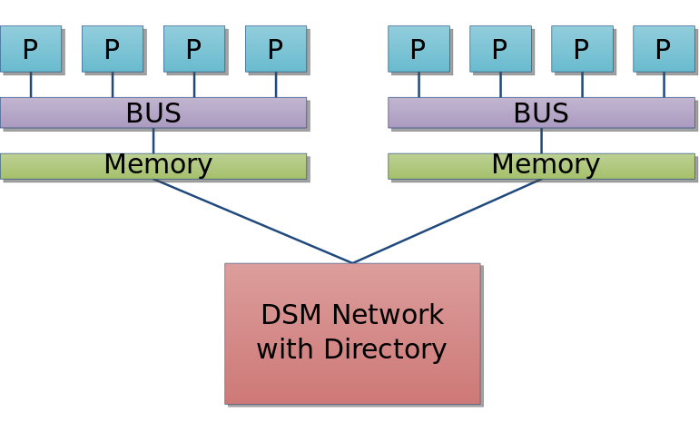

# Shared memory
  In computer hardware, **shared memory** refers to block of random access memory(RAM) that can
be accessed by several different CPUs in a multiprocessor computer system.

  Shared memory systems may use:
- *uniform memory access(UMA*): all processors share the physical memory uniformly;
- *non-uniform memory access(NUMA)*: memory access time depends on the memory location relative
to a processor;
- *cache-only memory architecture(COMA)*: the local memories for the processors at each node
is used as cache instead of as actual main memory.

## NUMA
  **NUMA**(non-uniform memory access) is a computer memory design used in multiprocessing, where
the memory access time depends on the memory location relative to the processor.
  In NUMA, a processor can access its own **local memory** faster than non-local memory.

## SMP
  In **SMP**(Symmetric multiprocessing), all processors are connected to a single shared main
memory, there is no such concept as local memory.

