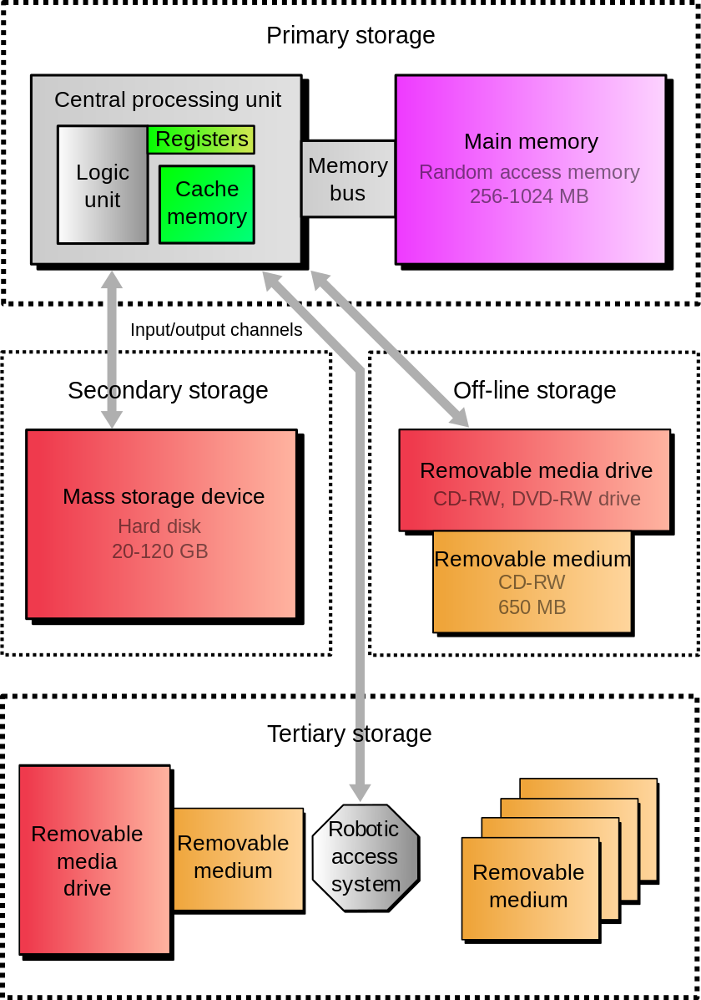
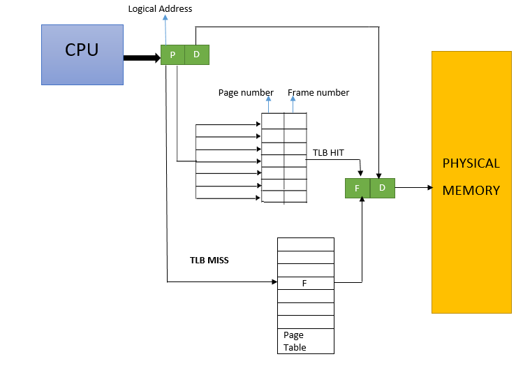
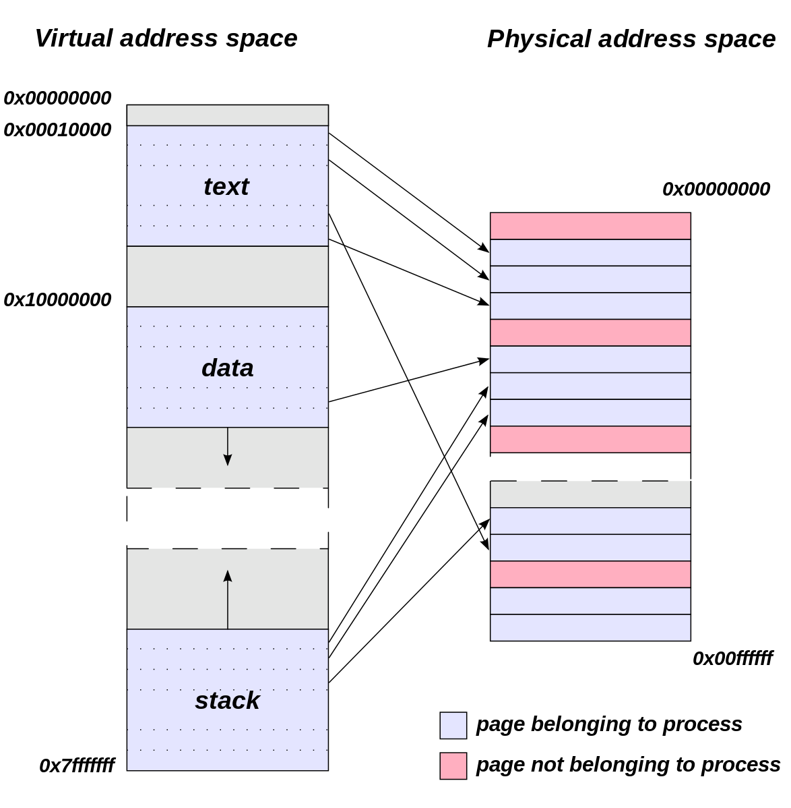
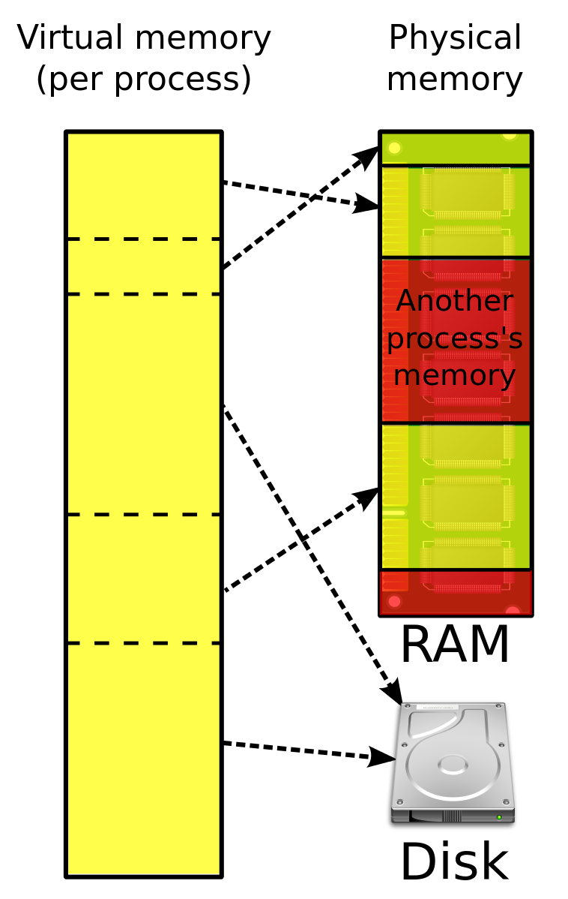

# Virtual Memory

## 1. Primary Storage & Secondary Storage
  The term "memory", meaning "**Primary Storage**" or "**main memory**" is often associate with 
addressable semiconductor memory which operate at a high speed, for example **RAM**. 
  **Secondary Storage** differs from primary storage in that it is not directly accessible by
the CPU, the computer usually uses its *input*/*output* channels to access secondary storage.
Hard disk Drives(*HDD*) or Solid-State Drives(*SSD*) are usually used as secondary storages. 

## 2. Virtual Address
  OS, using a combination of hardware and software, maps memory address used by a program,
called **virtual address**, into physical addresses in computer main memory.

### 2.1 MMU
Address translation hardware in the CPU, often referred to as a **Memory Management Unit**(MMU),
automatically translates virtual addresses to physical addresses.

### 2.2 TLB
The fast path through the MMU can perform those translations stored in the **Translation
Lookaside Buffer**(TLB), which is a cache of the mapping from the OS's page table.

### 2.3 Page Table
A **Page Table** is the data structure used by a virtual memory system in an OS to store the
mapping between virtual addresses and physical addresses.

## 3. Virtual Memory
  Most general purpose CPUs implement some form of **virtual memory**. To summarize, it provide
a kind of *isolation* such that each program running on the machine sees its *own* simplified
address space, which contains code and data for that program *only*.
  Virtual Memory makes application programming *easier* by hiding fragmentation of physical
memory; by delegating to the kernel the burden of managing the memory hierarchy.

## 4. Paging
  **Paging** is a memory management scheme by which a computer stores and retrieves data from
**secondary storage** for use in main memory. In this scheme, OS retrieves data in same-size
blocks called **pages**.
  Paging is an important part of virtual memory implementation in modern OS, using secondary
storage to let programs *exceed* the size of available physical memory.
